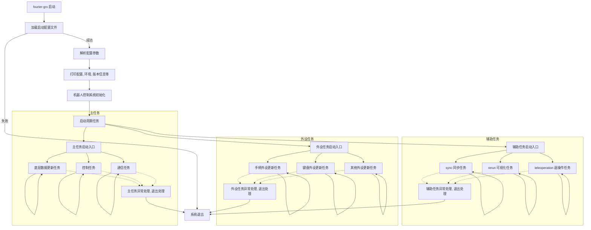
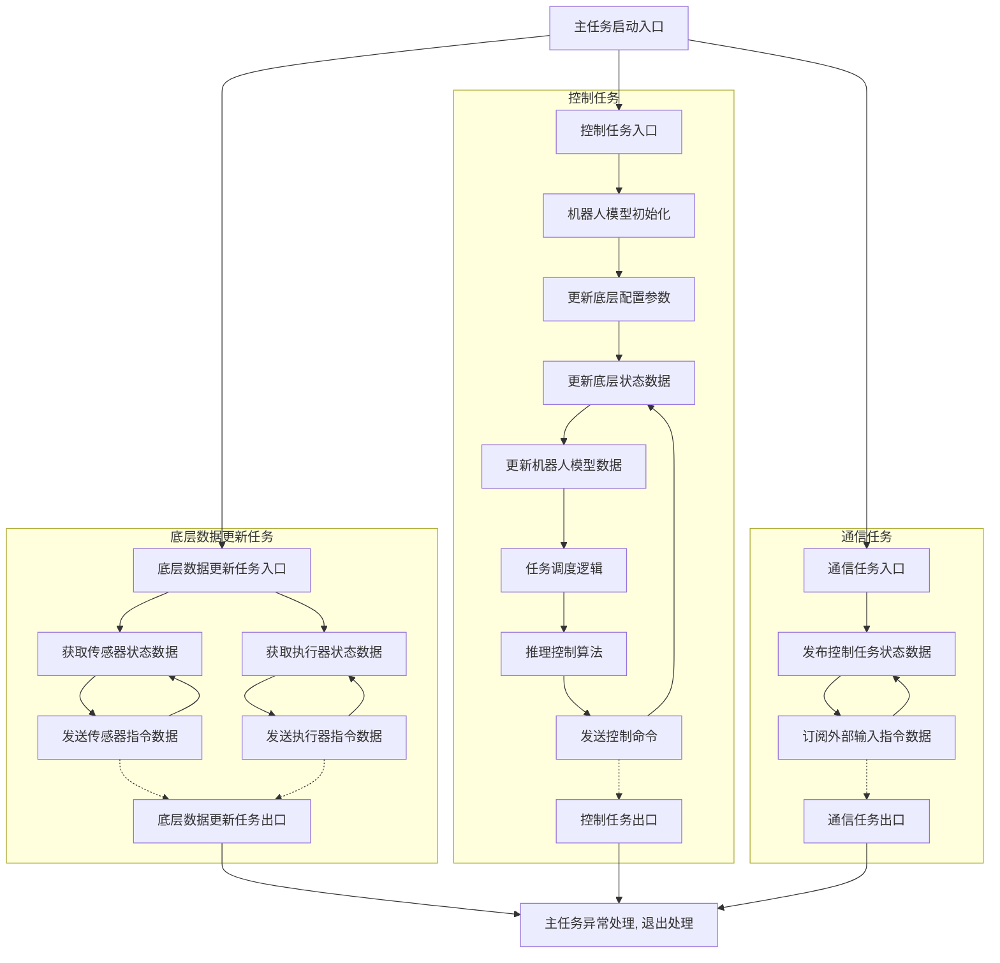
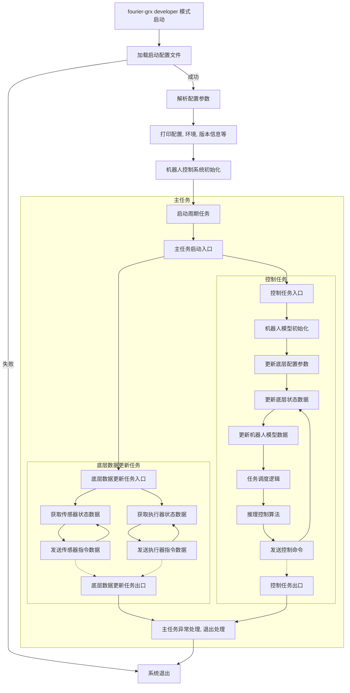

# 系统运行逻辑

fourier-grx 系统的运行逻辑主要包括启动配置文件的加载、机器人初始化以及周期任务的启动等几个关键步骤。以下是系统运行逻辑的详细说明：

(为防止浏览器渲染问题，这里添加了图片附件 [系统运行逻辑](/fourier-grx-N1/assets/images/system_running_logic_1.png))

1. 启动配置文件加载 (参考：[启动配置文件](/fourier-grx-N1/docs/reference/config_file))
    - 系统启动时，会根据用户指定的配置文件路径加载启动配置文件。该文件通常为 YAML 格式，包含了机器人运行所需的各种参数配置。
    - 配置文件中的关键参数包括但不限于：`机器人名称`、`机器人机械结构类型`、子功能模块相关配置、日志相关配置、控制系统相关配置等。
    - 用户可以根据实际需求修改配置文件中的参数，以实现对机器人的个性化配置。
    - 如果配置文件中存在错误或缺失关键参数，系统将无法正常启动，并会输出相应的错误信息。

2. 周期任务启动
    - 周期任务大致可分为三类：主任务、辅助任务和外设任务。
    - 主任务包括底层数据更新任务、控制任务和通信任务，负责机器人的核心运行逻辑。
    - 辅助任务包括 sync 同步任务、rerun 可视化任务和 teleoperation 遥操作任务等，负责提供额外的功能支持。
    - 外设任务包括手柄外设更新任务、键盘外设更新任务和其他外设更新任务，负责处理各种外设的输入输出。

## 主任务启动逻辑

(为防止浏览器渲染问题，这里添加了图片附件 [主任务启动逻辑](/fourier-grx-N1/assets/images/system_running_logic_2.png))

- `机器人名称` + `机器人机械结构类型`：共同决定了程序启动时以哪个型号的机器人进行初始化和后续的控制。如果配置错误，程序将可能无法正确启动。
- 程序启动后，默认会启动三个周期任务：底层数据更新任务、控制任务和通信任务。
    - 底层数据更新任务负责与机器人底层硬件进行数据交互，获取传感器数据并发送执行器指令。
    - 控制任务负责更新外设状态数据、更新机器人运动学参数、推理控制算法、发送控制命令
    - 通信任务负责对接上层数据传输，将控制任务中的数据进行发布和订阅外部输入的指令数据。
    - 用户可以根据实际需求调整这两个任务的周期，但需要确保通信周期不小于控制周期。如果通信周期小于控制周期，数据更新可能不会连续。

## 开发者模式启动逻辑

在开发者模式（developer）下，启动逻辑与普通模式类似，但会有如下一些区别点：

- 系统会关闭辅助任务和外设任务，以便防止干扰主任务的调试和测试。
- 系统会关闭通信任务，以便用户可以专注于控制任务的开发和调试。
- 由于开发者模式下主要有用户完成算法任务的调度和控制算法的推理，因此 fourier-grx 本身的控制任务调度默认会运行在 `TASK_IDLE` 待机状态，以便用户可以专注于自己的算法开发。
    - 只在用户通过 `control_system.robot_control_set_task_command` 接口显式设置任务命令时，才会执行相应的任务调度逻辑。

(为防止浏览器渲染问题，这里添加了图片附件 [开发者模式启动逻辑](/fourier-grx-N1/assets/images/system_running_logic_3.png))
